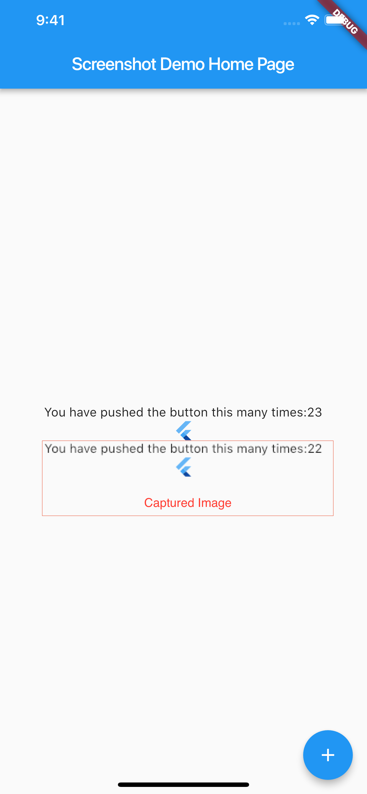

# screenshot

A simple plugin to capture widgets as Images.

This plugin wraps your widgets inside [RenderRepaintBoundary](https://docs.flutter.io/flutter/rendering/RenderRepaintBoundary-class.html)

[Source](https://stackoverflow.com/a/51118088)

## Getting Started

This handy plugin can be used to capture any Widget including full screen screenshots & individual widgets like Text().

1) Create Instance of Screenshot Controller

```dart
class _MyHomePageState extends State<MyHomePage> {
  int _counter = 0;
  File _imageFile;

  //Create an instance of ScreenshotController
  ScreenshotController screenshotController = ScreenshotController(); 

  @override
  void initState() {
    // TODO: implement initState
    super.initState();
  }
  ...
}
```
2) Wrap the widget that you want to capture inside **Screenshot** Widget. Assign the controller to screenshotController that you have created earlier

```dart
Screenshot(
    controller: screenshotController,
    child: Text("This text will be captured as image"),
),
```

3) Take the screenshot by calling capture method. This will return a File

```dart
screenshotController.capture().then((File image) {
    //Capture Done
    setState(() {
        _imageFile = image;
    });
}).catchError((onError) {
    print(onError);
});
```

Example:

```dart
@override
  Widget build(BuildContext context) {
    return Scaffold(
      appBar: AppBar(
        title: Text(widget.title),
      ),
      body: Container(
        child: new Center(
          child: Column(
            mainAxisAlignment: MainAxisAlignment.center,
            children: <Widget>[
              Screenshot(
                controller: screenshotController,
                child: Column(
                  children: <Widget>[
                    Text(
                      'You have pushed the button this many times:' +
                          _counter.toString(),
                    ),
                    FlutterLogo(),
                  ],
                ),
              ),
              _imageFile != null ? Image.file(_imageFile) : Container(),
            ],
          ),
        ),
      ),
      floatingActionButton: FloatingActionButton(
        onPressed: () {
          _incrementCounter();
          _imageFile = null;
          screenshotController
              .capture()
              .then((File image) async {
            //print("Capture Done");
            setState(() {
              _imageFile = image;
            });
            final result =
                await ImageGallerySaver.save(image.readAsBytesSync()); // Save image to gallery,  Needs plugin  https://pub.dev/packages/image_gallery_saver
            print("File Saved to Gallery");
          }).catchError((onError) {
            print(onError);
          });
        },
        tooltip: 'Increment',
        child: Icon(Icons.add),
      ), // This trailing comma makes auto-formatting nicer for build methods.
    );
  }
```

 


By defualt, the captured image will be saved to Application Directory. Custom paths can be set using **path parameter**. Refer [path_provider](https://pub.dartlang.org/packages/path_provider)
```dart
final directory = (await getApplicationDocumentsDirectory ()).path; //from path_provide package
String fileName = DateTime.now().toIso8601String();
path = '$directory/$fileName.png';

screenshotController.capture(
    path:path //set path where screenshot will be saved
);
```

## Saving images to Gallery
If you want to save captured image to Gallery, Please use https://github.com/hui-z/image_gallery_saver
Example app uses the same to save screenshots to gallery.

## Note:
Captured image may look pixelated. You can overcome this issue by setting value for **pixelRatio** 

>The pixelRatio describes the scale between the logical pixels and the size of the output image. It is independent of the window.devicePixelRatio for the device, so specifying 1.0 (the default) will give you a 1:1 mapping between logical pixels and the output pixels in the image.


```dart
screenshotController.capture(
    pixelRatio: 1.5
)
```

## Known Bugs
- Image will not be updated if same filename is given multiple times

